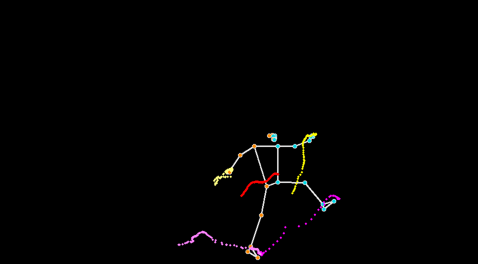

## Climbing pse estimation

We use open-source tools like mediapipe and opencv to track climber body poses during routes. I saw this on internet and figured it cant be that hard to reproduce. 

Here is an sample photo that looks cool:

## Usage

1. install Google mediapipe with `pip3 install mediapipe`
2. Run with `python3 pose.py`

