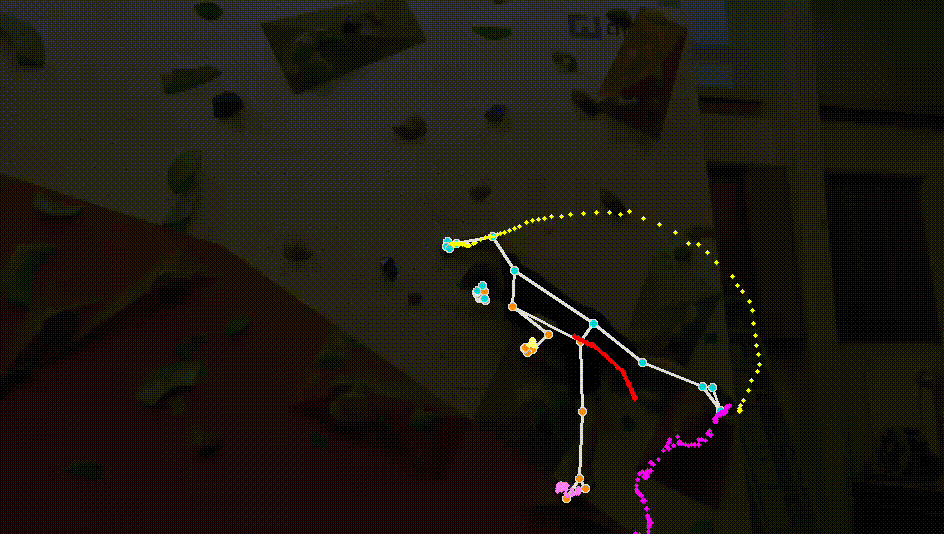

## Climbing pose estimation

We use open-source tools like mediapipe and opencv to track climber body poses during routes. I saw this on internet and figured it cant be that hard to reproduce. 

Here is sample video that looks cool:

And an image also if you dont like moving things:

## Usage

1. install Google mediapipe with `pip3 install mediapipe`
2. Run with `python3 pose.py`

